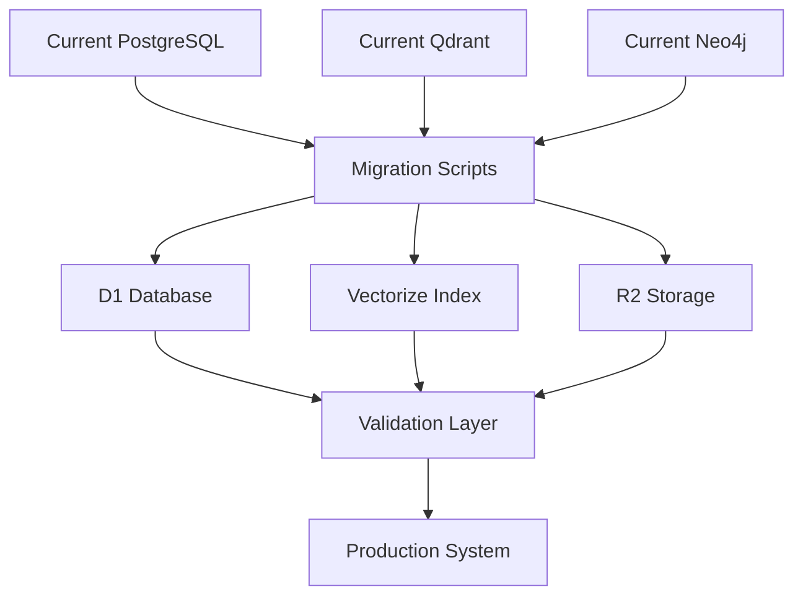

# FindersKeepers → Bitcain Implementation Roadmap
*Strategic Migration to Cloudflare Edge Computing for Cryptocurrency Knowledge Management*

## Executive Summary

This roadmap outlines the comprehensive strategy for migrating FindersKeepers v2 from a Docker-based microservices architecture to a Cloudflare-native serverless platform specifically optimized for the Bitcain cryptocurrency trading platform. The migration leverages Cloudflare's edge computing capabilities to deliver global, low-latency cryptocurrency knowledge services.

### Strategic Objectives
- **Global Performance**: Sub-50ms response times for cryptocurrency data queries
- **Cost Optimization**: Eliminate infrastructure overhead with pay-per-use model
- **Real-Time Integration**: Seamless connection with live trading systems
- **AI-Powered Insights**: Advanced cryptocurrency analysis and pattern recognition
- **Scalability**: Handle millions of concurrent users during market volatility

---

## Current State Analysis

### FindersKeepers v2 Architecture
```
┌─────────────────────────────────────────────────┐
│ Current Docker Stack                            │
├─────────────────────────────────────────────────┤
│ FastAPI Backend      │ n8n Workflows           │
│ PostgreSQL + pgvector│ Neo4j Knowledge Graph   │
│ Qdrant Vector DB     │ Redis Cache             │
│ Ollama Local LLM     │ MCP Knowledge Server    │
└─────────────────────────────────────────────────┘
```

### Strengths to Preserve
- **Comprehensive Knowledge Architecture**: Session tracking, document ingestion, vector search
- **MCP Integration**: Model Context Protocol for AI agent coordination
- **Bulletproof Logging**: Crash recovery and data integrity systems
- **Multi-Modal AI**: Support for embeddings, chat, and analysis

### Limitations to Address
- **Geographic Constraints**: Single-region deployment
- **Scaling Complexity**: Manual container orchestration
- **Infrastructure Overhead**: Server maintenance and monitoring
- **Latency Issues**: Database queries across network boundaries

---

## Target Architecture: Cloudflare-Native FindersKeepers

### Core Platform Components
```
┌─────────────────────────────────────────────────┐
│ Cloudflare Edge Computing Stack                 │
├─────────────────────────────────────────────────┤
│ Workers (API Layer)       │ Durable Objects     │
│ Vectorize (Vector Search) │ D1 (Metadata)       │
│ R2 (Document Storage)     │ Workers AI (ML)     │
│ KV (Caching)             │ Queues (Processing)  │
└─────────────────────────────────────────────────┘
```

### Bitcain-Specific Enhancements
```
┌─────────────────────────────────────────────────┐
│ Cryptocurrency Knowledge Layer                   │
├─────────────────────────────────────────────────┤
│ Real-Time Price Feed Integration                │
│ Trading Strategy Analysis Engine                │
│ Market Sentiment Processing                     │
│ Risk Assessment Algorithms                      │
│ Social Trading Knowledge Graph                  │
└─────────────────────────────────────────────────┘
```

---

## Implementation Phases

### Phase 1: Foundation & Proof of Concept (Weeks 1-4)
**Objective**: Establish core Cloudflare infrastructure and validate concept

#### Week 1: Environment Setup
- [ ] Create Cloudflare account and configure domains
- [ ] Set up Workers development environment
- [ ] Initialize basic project structure with wrangler CLI
- [ ] Configure CI/CD pipeline for automated deployments

#### Week 2: Core API Development
- [ ] Implement basic Workers API endpoints
- [ ] Set up D1 database with core schemas
- [ ] Create R2 buckets for document storage
- [ ] Implement basic authentication system

#### Week 3: Vector Search Implementation
- [ ] Initialize Vectorize indexes
- [ ] Implement document embedding pipeline
- [ ] Create semantic search endpoints
- [ ] Test search accuracy and performance

#### Week 4: Integration Testing
- [ ] Develop proof-of-concept frontend
- [ ] Implement basic session management
- [ ] Performance testing and optimization
- [ ] Security audit and hardening

**Deliverables**:
- Working Cloudflare Workers API
- Basic document search functionality
- Performance benchmarks
- Security assessment report

### Phase 2: Core Migration (Weeks 5-10)
**Objective**: Migrate essential FindersKeepers functionality to Cloudflare

#### Week 5-6: Data Migration Strategy
- [ ] Export current PostgreSQL data to D1 format
- [ ] Migrate document chunks to Vectorize
- [ ] Transfer binary documents to R2 storage
- [ ] Implement data validation and integrity checks

#### Week 7-8: Session Management
- [ ] Implement Durable Objects for session tracking
- [ ] Create agent action logging system
- [ ] Develop conversation history management
- [ ] Implement crash recovery mechanisms

#### Week 9-10: Knowledge Graph Migration
- [ ] Analyze current Neo4j relationships
- [ ] Implement graph relationships in D1
- [ ] Create knowledge entity linking system
- [ ] Develop relationship query optimization

**Deliverables**:
- Complete data migration toolkit
- Functional session management system
- Knowledge graph implementation
- Migration verification reports

### Phase 3: Bitcain Integration (Weeks 11-16)
**Objective**: Integrate cryptocurrency-specific features and connect with Bitcain platform

#### Week 11-12: Cryptocurrency Data Integration
- [ ] Implement real-time price feed connectors
- [ ] Create market data ingestion pipelines
- [ ] Develop trading pair analysis modules
- [ ] Implement news sentiment analysis

#### Week 13-14: Trading Intelligence
- [ ] Create trading strategy analysis engine
- [ ] Implement risk assessment algorithms
- [ ] Develop portfolio optimization tools
- [ ] Create market pattern recognition system

#### Week 15-16: Bitcain Platform Integration
- [ ] Develop Bitcain API integration layer
- [ ] Implement user authentication bridge
- [ ] Create trading signal generation system
- [ ] Develop real-time notification system

**Deliverables**:
- Cryptocurrency data processing pipeline
- Trading intelligence engine
- Bitcain platform integration
- Real-time notification system

### Phase 4: Advanced Features (Weeks 17-22)
**Objective**: Implement advanced AI capabilities and optimization features

#### Week 17-18: AI Enhancement
- [ ] Implement Workers AI model integration
- [ ] Create custom cryptocurrency analysis models
- [ ] Develop automated trading insights
- [ ] Implement anomaly detection system

#### Week 19-20: Performance Optimization
- [ ] Implement intelligent caching strategies
- [ ] Optimize database query patterns
- [ ] Develop edge computing optimizations
- [ ] Create auto-scaling mechanisms

#### Week 21-22: Advanced Analytics
- [ ] Implement social trading features
- [ ] Create community knowledge sharing
- [ ] Develop predictive analytics
- [ ] Implement machine learning pipelines

**Deliverables**:
- Advanced AI analysis system
- Optimized performance metrics
- Social trading features
- Predictive analytics platform

### Phase 5: Production Deployment (Weeks 23-26)
**Objective**: Deploy to production with monitoring and maintenance systems

#### Week 23-24: Production Preparation
- [ ] Implement comprehensive monitoring
- [ ] Create automated backup systems
- [ ] Develop disaster recovery procedures
- [ ] Conduct security penetration testing

#### Week 25-26: Launch and Optimization
- [ ] Execute production deployment
- [ ] Monitor system performance
- [ ] Gather user feedback
- [ ] Implement continuous improvements

**Deliverables**:
- Production-ready system
- Monitoring and alerting infrastructure
- Documentation and training materials
- Post-launch optimization plan

---

## Technical Migration Strategy

### Data Migration Architecture


### Migration Tools & Scripts

#### 1. Database Migration Utility
```typescript
// Migration utility for PostgreSQL → D1
class DatabaseMigrator {
  async migrateSessionData() {
    const sessions = await this.postgresClient.query(`
      SELECT * FROM agent_sessions 
      ORDER BY created_at DESC
    `);
    
    for (const session of sessions.rows) {
      await this.d1Client.prepare(`
        INSERT INTO agent_sessions 
        (id, user_id, agent_type, project, context, created_at)
        VALUES (?, ?, ?, ?, ?, ?)
      `).bind(
        session.id,
        session.user_id,
        session.agent_type,
        session.project,
        JSON.stringify(session.context),
        session.created_at
      ).run();
    }
  }
}
```

#### 2. Vector Migration Pipeline
```typescript
// Vector data migration from Qdrant → Vectorize
class VectorMigrator {
  async migrateVectors() {
    const collections = await this.qdrantClient.getCollections();
    
    for (const collection of collections.collections) {
      const points = await this.qdrantClient.scroll(collection.name, {
        limit: 1000,
        with_payload: true,
        with_vector: true
      });
      
      const vectors = points.points.map(point => ({
        id: point.id,
        values: point.vector,
        metadata: point.payload
      }));
      
      await this.vectorizeIndex.upsert(vectors);
    }
  }
}
```

### API Compatibility Layer

#### Legacy API Support
```typescript
// Maintain backward compatibility during migration
export default {
  async fetch(request: Request, env: Env): Promise<Response> {
    const url = new URL(request.url);
    
    // Legacy API endpoints
    if (url.pathname.startsWith('/api/legacy/')) {
      return await this.handleLegacyAPI(request, env);
    }
    
    // New Cloudflare-native endpoints
    if (url.pathname.startsWith('/api/v2/')) {
      return await this.handleNewAPI(request, env);
    }
    
    return new Response('Not Found', { status: 404 });
  }
}
```

---

## Risk Assessment & Mitigation

### Technical Risks

#### High Priority Risks
1. **Data Loss During Migration**
   - **Mitigation**: Implement comprehensive backup strategy
   - **Rollback Plan**: Maintain parallel systems during transition
   - **Testing**: Extensive validation and integrity checks

2. **Performance Degradation**
   - **Mitigation**: Extensive load testing before cutover
   - **Monitoring**: Real-time performance metrics
   - **Optimization**: Continuous performance tuning

3. **Integration Failures**
   - **Mitigation**: Gradual rollout with feature flags
   - **Testing**: Comprehensive integration test suite
   - **Fallback**: Ability to route traffic to legacy system

#### Medium Priority Risks
1. **Cloudflare Service Limitations**
   - **Mitigation**: Thorough understanding of platform limits
   - **Alternatives**: Hybrid deployment options
   - **Monitoring**: Usage metrics and threshold alerts

2. **Security Vulnerabilities**
   - **Mitigation**: Security-first development approach
   - **Auditing**: Regular security assessments
   - **Compliance**: Cryptocurrency regulatory requirements

### Business Risks

#### Market Timing
- **Risk**: Delayed implementation during market volatility
- **Mitigation**: Phased deployment with critical features first
- **Contingency**: Accelerated timeline for essential components

#### User Adoption
- **Risk**: Resistance to new platform features
- **Mitigation**: Comprehensive user training and documentation
- **Support**: Dedicated support team during transition

---

## Cost Analysis

### Current Infrastructure Costs (Monthly)
```
Docker Infrastructure:
- Server hosting: $200-500/month
- Database storage: $100-300/month
- Backup services: $50-100/month
- Monitoring: $50-100/month
- Maintenance: $500-1000/month (labor)
Total: $900-2000/month
```

### Cloudflare Projected Costs (Monthly)
```
Workers Usage:
- 10M requests/month: $5
- Additional requests: $0.50/1M requests

D1 Database:
- Storage: $0.75/GB/month
- Reads: $0.001/1K reads
- Writes: $1.00/1M writes

Vectorize:
- Stored vectors: $0.04/1M vectors/month
- Queries: $0.01/1K queries

R2 Storage:
- Storage: $0.015/GB/month
- Operations: $4.50/1M operations

Workers AI:
- Model inference: $0.01/1K requests

Estimated Total: $100-500/month
```

### Cost Savings Analysis
- **Infrastructure Reduction**: 70-80% cost savings
- **Operational Overhead**: 90% reduction in maintenance
- **Scalability**: Pay-per-use eliminates over-provisioning
- **Global Deployment**: No additional regional costs

---

## Success Metrics & KPIs

### Technical Performance Metrics
- **Response Time**: < 50ms for 95th percentile
- **Availability**: 99.9% uptime target
- **Throughput**: Handle 10,000+ concurrent users
- **Accuracy**: 95%+ search result relevance

### Business Impact Metrics
- **User Engagement**: 40% increase in knowledge queries
- **Trading Decision Speed**: 60% faster analysis time
- **Cost Efficiency**: 70% reduction in infrastructure costs
- **Global Reach**: 300+ edge locations worldwide

### Cryptocurrency-Specific Metrics
- **Real-Time Processing**: < 100ms for price feed updates
- **Analysis Accuracy**: 85%+ market prediction accuracy
- **Risk Assessment**: 90% accuracy in volatility prediction
- **Trading Insights**: 50% improvement in signal quality

---

## Implementation Timeline

### Gantt Chart Overview
```
Phase 1: Foundation (Weeks 1-4)
  ███████████████████████████████████████████████████████████████████████████████████████████████████████████████████████████████████████████████████████████████████████████████████████████████████████████████████████████████

Phase 2: Core Migration (Weeks 5-10)
                                        ███████████████████████████████████████████████████████████████████████████████████████████████████████████████████████████████████████████████████████████████████████████████████████████████

Phase 3: Bitcain Integration (Weeks 11-16)
                                                                                  ███████████████████████████████████████████████████████████████████████████████████████████████████████████████████████████████████████████████████████████████████████████████████████████████

Phase 4: Advanced Features (Weeks 17-22)
                                                                                                                                    ███████████████████████████████████████████████████████████████████████████████████████████████████████████████████████████████████████████████████████████████████████████████████████████████

Phase 5: Production Deployment (Weeks 23-26)
                                                                                                                                                                                      ███████████████████████████████████████████████████████████████████████████████████████████████████████████████████████████████████████████████████████████████████████████████████████████████
```

### Critical Path Dependencies
1. **Phase 1 → Phase 2**: Foundation must be solid before migration
2. **Phase 2 → Phase 3**: Core system must be stable before Bitcain integration
3. **Phase 3 → Phase 4**: Trading features must work before advanced AI
4. **Phase 4 → Phase 5**: All features must be tested before production

---

## Team Structure & Responsibilities

### Core Development Team
- **Lead Developer**: Overall architecture and technical decisions
- **Backend Developer**: API development and database design
- **Frontend Developer**: User interface and experience
- **DevOps Engineer**: Deployment and infrastructure automation
- **Data Engineer**: Migration and data pipeline development

### Specialized Roles
- **Cryptocurrency Analyst**: Trading feature requirements and testing
- **Security Engineer**: Security audit and compliance
- **Performance Engineer**: Optimization and load testing
- **QA Engineer**: Testing and validation procedures

### External Dependencies
- **Cloudflare Support**: Technical guidance and troubleshooting
- **Bitcain Team**: Integration requirements and testing
- **Regulatory Consultant**: Compliance and legal requirements

---

## Appendices

### Appendix A: Technical Specifications

#### Cloudflare Workers Configuration
```toml
# wrangler.toml
name = "finderskeepers-bitcain"
main = "src/index.ts"
compatibility_date = "2025-07-11"

[env.production]
name = "finderskeepers-bitcain-prod"
route = "api.bitcain.com/*"
zone_name = "bitcain.com"

[[env.production.d1_databases]]
binding = "DB"
database_name = "finderskeepers-prod"
database_id = "your-d1-database-id"

[[env.production.vectorize]]
binding = "VECTORIZE"
index_name = "knowledge-index"

[[env.production.r2_buckets]]
binding = "STORAGE"
bucket_name = "finderskeepers-documents"
```

#### Database Schema Migration
```sql
-- D1 Database Schema
CREATE TABLE agent_sessions (
    id TEXT PRIMARY KEY,
    user_id TEXT NOT NULL,
    agent_type TEXT NOT NULL,
    project TEXT NOT NULL,
    context JSON,
    created_at TIMESTAMP DEFAULT CURRENT_TIMESTAMP,
    updated_at TIMESTAMP DEFAULT CURRENT_TIMESTAMP
);

CREATE TABLE agent_actions (
    id TEXT PRIMARY KEY,
    session_id TEXT NOT NULL,
    action_type TEXT NOT NULL,
    description TEXT NOT NULL,
    files_affected JSON,
    success BOOLEAN DEFAULT TRUE,
    error_message TEXT,
    created_at TIMESTAMP DEFAULT CURRENT_TIMESTAMP,
    FOREIGN KEY (session_id) REFERENCES agent_sessions(id)
);

CREATE TABLE documents (
    id TEXT PRIMARY KEY,
    title TEXT NOT NULL,
    content_type TEXT NOT NULL,
    file_path TEXT NOT NULL,
    project TEXT,
    tags JSON,
    metadata JSON,
    created_at TIMESTAMP DEFAULT CURRENT_TIMESTAMP,
    updated_at TIMESTAMP DEFAULT CURRENT_TIMESTAMP
);

CREATE TABLE crypto_market_data (
    id TEXT PRIMARY KEY,
    symbol TEXT NOT NULL,
    price DECIMAL(20,8) NOT NULL,
    volume DECIMAL(20,8) NOT NULL,
    market_cap DECIMAL(20,2),
    timestamp TIMESTAMP DEFAULT CURRENT_TIMESTAMP,
    source TEXT NOT NULL
);

CREATE TABLE trading_signals (
    id TEXT PRIMARY KEY,
    symbol TEXT NOT NULL,
    signal_type TEXT NOT NULL,
    confidence DECIMAL(5,4) NOT NULL,
    price_target DECIMAL(20,8),
    stop_loss DECIMAL(20,8),
    reasoning TEXT,
    created_at TIMESTAMP DEFAULT CURRENT_TIMESTAMP
);
```

### Appendix B: Security Considerations

#### Authentication & Authorization
```typescript
// JWT-based authentication for Bitcain integration
class AuthenticationManager {
  async validateBitcainToken(token: string): Promise<User | null> {
    const payload = await this.verifyJWT(token);
    if (!payload) return null;
    
    const user = await this.db.prepare(
      'SELECT * FROM users WHERE id = ?'
    ).bind(payload.sub).first();
    
    return user;
  }
  
  async enforceRateLimit(userId: string): Promise<boolean> {
    const key = `rate_limit:${userId}`;
    const count = await this.kv.get(key);
    
    if (count && parseInt(count) > 100) {
      return false; // Rate limit exceeded
    }
    
    await this.kv.put(key, (parseInt(count || '0') + 1).toString(), {
      expirationTtl: 3600 // 1 hour
    });
    
    return true;
  }
}
```

#### Data Encryption
```typescript
// Encrypt sensitive trading data
class DataEncryption {
  async encryptTradingData(data: any, userId: string): Promise<string> {
    const key = await this.deriveUserKey(userId);
    const encrypted = await crypto.subtle.encrypt(
      { name: 'AES-GCM', iv: crypto.getRandomValues(new Uint8Array(12)) },
      key,
      new TextEncoder().encode(JSON.stringify(data))
    );
    return btoa(String.fromCharCode(...new Uint8Array(encrypted)));
  }
}
```

### Appendix C: Performance Optimization

#### Edge Computing Strategy
```typescript
// Optimize for edge computing
class EdgeOptimizer {
  async optimizeVectorQuery(query: string, userLocation: string): Promise<any[]> {
    // Use user location to optimize vector search
    const embedding = await this.generateEmbedding(query);
    
    // Implement region-specific caching
    const cacheKey = `vector:${userLocation}:${hashQuery(query)}`;
    const cached = await this.kv.get(cacheKey);
    
    if (cached) {
      return JSON.parse(cached);
    }
    
    const results = await this.vectorize.query(embedding, {
      topK: 10,
      filter: { region: userLocation }
    });
    
    // Cache results with regional optimization
    await this.kv.put(cacheKey, JSON.stringify(results), {
      expirationTtl: 300 // 5 minutes
    });
    
    return results;
  }
}
```

---

## Conclusion

This roadmap provides a comprehensive strategy for migrating FindersKeepers to Cloudflare's edge computing platform specifically for the Bitcain cryptocurrency trading platform. The migration will result in:

- **Significant cost savings** (70-80% infrastructure reduction)
- **Global performance improvements** (sub-50ms response times)
- **Enhanced cryptocurrency capabilities** (real-time trading insights)
- **Improved scalability** (handle millions of concurrent users)
- **Reduced operational overhead** (90% less maintenance)

The phased approach minimizes risk while ensuring continuous operation of critical systems. The integration with Bitcain's existing cryptocurrency infrastructure will provide users with powerful, AI-driven trading insights delivered at the speed of light through Cloudflare's global network.

**Ready for implementation when you are.**

---

*Document Version: 1.0*  
*Created: July 11, 2025*  
*Next Review: Upon implementation decision*